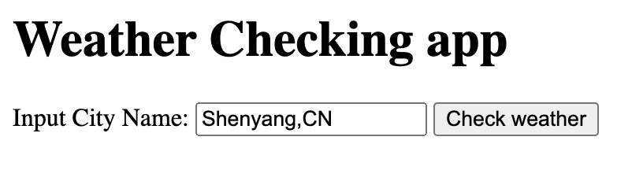
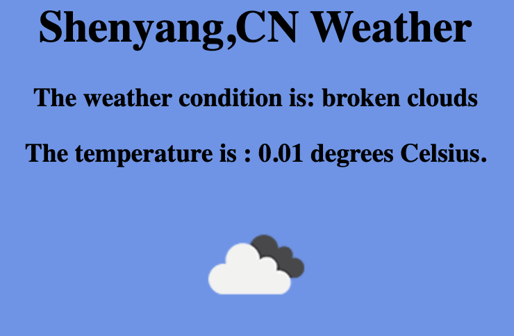

This program takes is a city name and then returns live weather using Open Weather API.
It uses nodejs as backend. This program can be incorporated into any website to display live weather data to customers.

You can install all the required node modules through **npm install**. You will need to get your own API key from openweather api because sharing my key will lead to my account being terminated.

